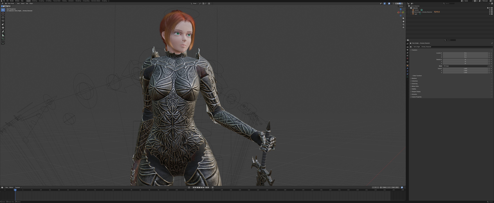
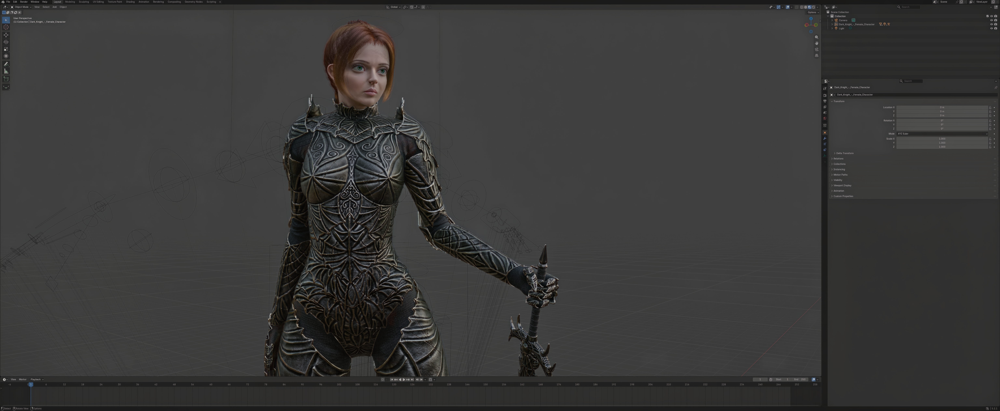

# DLSS 5 Neural Lens

**Beta, version 0.6.0.** See [CHANGELOG.md](CHANGELOG.md). While the version starts with 0,
settings, the state file format and behaviour may change between releases.

A floating see-through window for Windows. Drag it over anything on your desktop and the
content underneath appears inside it with **NVIDIA DLSS Neural Rendering** applied, live. The
mouse passes straight through the viewport, so you can keep using whatever is beneath it, much
like the Windows Magnifier lens.





*Blender 5.2 under version 0.5.0 of the lens in fullscreen, before and after one pass. The model is
[Dark Knight, Female Character](https://www.fab.com/listings/5be9349e-acb1-4a0b-8811-9e999e036755) by
Hawtor Studio, [CC BY 4.0](https://creativecommons.org/licenses/by/4.0/).*

The point of it is that Neural Rendering normally exists only inside an application that
integrates DLSS. This puts it on anything that can be drawn on your screen: a browser, a video,
an emulator, a photo, a remote desktop session. Nothing is injected into the target application,
and the target does not need to know anything about DLSS. [What the lens does and does not
do](#what-the-lens-does-and-does-not-do) says what it touches and what it leaves alone.

It can apply **up to four neural passes**, chosen with plus and minus in the title bar and
applied with Set, and its picture runs about one refresh behind the screen. A game in front that
keeps the graphics card fully busy holds the picture further back, see [A game in front that
keeps the card busy](#a-game-in-front-that-keeps-the-card-busy). Maximised, it fills its monitor
with the picture alone, drawn by a second engine of the lens's own that is made for fullscreen.

## Requirements

- Windows 10 build 19041 or later, 64 bit, which is what the installer requires. The capture
  path uses Windows.Graphics.Capture. It has only ever been tested here on Windows 11 25H2.
- An NVIDIA RTX card with a driver new enough for DLSS Neural Rendering. The setup reads the
  compute capability from `nvidia-smi` and stops below 7.5, which is the RTX 20 series and newer.
  This release was tested with NVIDIA driver 617.14 on Windows 11 25H2, and the driver a
  release was tested with is named in its release notes.
- Room on disk for about 400 MB once the stack is in place, of which about 150 MB is downloaded
  during installation.

The installed lens does not need Python. That is only for running from source, below.

## Install

**The installer.** Download `NeuralLens-Setup-<version>.exe` from
[the releases page](https://github.com/Leaps-Bounds/neural-lens/releases) and run it.

**Windows will warn you before it runs.** The installer is not code-signed, so Microsoft Defender
SmartScreen shows "Windows protected your PC" and gives the publisher as Unknown. Click More info
if it is offered, then Run anyway. Every release publishes the installer's sha256, so check the
file you downloaded against it first, with `Get-FileHash NeuralLens-Setup-<version>.exe` in
PowerShell, rather than taking the warning's word in either direction.

It needs no administrator prompt. It installs for your user alone, into a folder you choose, and
adds two Start Menu entries, the lens and its stack setup, an uninstaller, and a desktop shortcut
if you tick that. The installer itself contains only the lens, its fast engine for fullscreen
included.

Setup offers to fetch the neural stack as part of the installation, as a checkbox that is
already ticked. Left ticked, it downloads about 150 MB and assembles the stack before setup
finishes, reporting each step as it goes. **A small window opens at the top left of the screen
for about nine seconds near the end.** That is the self test checking that Neural Rendering
really ran, and it closes itself. If that step fails, setup still completes and tells you which
log to read, and you can run it again afterwards from the Start Menu's stack setup entry. Untick
the box and nothing is downloaded, and that same entry is how you set it up later.

Everything the lens has lives in its one folder: the program, its presenter and the stack beside
them, the fast engine in `fast`, the layer in `ReShade`, and its state, logs and screenshots in
`data`. The stack sits beside the presenter because ReShade reads its configuration from the
folder of the program it attaches to. ReShade is registered as a Vulkan layer for your user only,
under its own name, and it switches on only in the lens's presenter, so an existing ReShade on the
machine is neither touched nor doubled. Uninstalling removes that folder, that one registry value
and the list on the lens's taskbar button, and nothing else. A DLL you pointed the setup at was
copied in, so the original stays where it was, and a `data_dir` you moved outside the install is
left alone.

**Installing over 0.1.0** removes the stack 0.1.0 assembled in its `stack` folder, mpv included.
NVIDIA's two runtimes and ReShade's DLL are moved across when they check out, so they are not
downloaded again. The window position and pass count are kept.

**Installing over an earlier version with the box unticked** keeps the stack, and with it the old
registration of the lens's ReShade, which Vulkan loads into every program that uses Vulkan. The
lens finds that when it starts, says so and offers the stack setup, which registers it for the
lens's presenter alone.

What it fetches, and from where:

| part | from |
|---|---|
| ReShade 6.8.0 with add-on support | reshade.me, the DLL taken out of the setup without running it |
| `nvngx_dlss.dll` 310.8.0 and the `310.8.SF-v2` Neural Rendering model | the RHI project's manifest; the model's builds are listed below |
| `renodx-dlss5.addon64` 5.2.1 | the RHI repository |
| DLSSNR-Cost-Scaler 1.0.6 | its release on GitHub |
| `dlss5-feed.addon64` and `DLSS5_Feed.fx` | DLSS5-Feeder, the current release |
| ReshadeMotionEstimation (CC BY-NC 4.0), VORT (MIT, its motion vector code CC BY-NC 4.0) and ReShade's two shader headers | their repositories |

NVIDIA's two runtimes, the add-on and the Cost Scaler are checked against sha256 hashes held in
`neural_stack.py`, and a download that matches none is refused. The Feeder comes from its current
release, ReshadeMotionEstimation is pinned to a commit, and the other shaders come from their
repositories as they stand.

**The Neural Rendering add-on starts at its own defaults, apart from two.** The setup writes
nothing into its section of `ReShade.ini` but the add-on's config version. Before the presenter
starts, the lens switches the add-on's chained temporal history on, since without it two passes
and up pulse, and sets its codec to Classic, as the add-on's developer asks. It sets each only
while the section holds no value for it. Change anything from the menu's Tweak NR settings, in
the ReShade overlay, or on the NR settings panel of a fullscreen lens on the fast engine, which
writes the same section. What you set stays, and a repair from the Start Menu keeps it.

If you already have NVIDIA's two DLLs, the Start Menu's stack setup entry has a field for each,
and `neural_stack.py` takes `--dlssnr` and `--dlss` on the command line. The installer's own page
does not ask. A DLL you point at is hash checked and copied in, and only the two `310.8.SF-v2`
builds listed under [The Neural Rendering model](#the-neural-rendering-model) are accepted.

Motion vectors come from ReshadeMotionEstimation by Jakob Wapenhensch, CC BY-NC 4.0, which
measured crisper on scrolling text than every other estimator that may be fetched. With it, the
setup is for personal, non-commercial use, which is what that licence allows. VORT is fetched too.
Most of its files are MIT, but its motion vector code, `vort_MotionVectors.fxh`, builds on
ReshadeMotionEstimation and is CC BY-NC 4.0 as well, so it carries the same limit. It can be
chosen only from the command line, with `NeuralLens.exe --install-stack --provider vort` from an
install or `python neural_stack.py --provider vort` from source, since the Start Menu entry always
uses the default.

### From source

If you would rather run it from the repository:

1. Put this folder anywhere you like. It runs in place.
2. Python 3 with tkinter, then `pip install numpy windows-capture glfw vulkan`.
3. Get a stack. `python neural_stack.py` fetches and assembles one into a `stack` folder beside
   the script, the same as the installer does, and the lens finds it there. The presenter in it is
   a copy of the Python that ran the setup, named `lens-presenter.exe`, and it uses that Python's
   packages. Run the lens with that same Python. A stack somewhere else can be named in any of
   these ways:
   - `Launch-LensNR.cmd --stack-dir "D:\path\to\stack"`
   - `set NEURAL_LENS_STACK=D:\path\to\stack`
   - copy `neural-lens.ini.example` to `neural-lens.ini` and set `stack_dir`
4. Build the fast engine, if fullscreen should run on it. `fast_engine\build.cmd` builds
   `lens-fast.exe` into `fast_engine\bin`, where the lens finds it with nothing copied. It needs
   MSVC from Visual Studio 2022 or later, or from its Build Tools, with the workload "Desktop
   development with C++", and Windows SDK 10.0.26100 or later. `build.cmd` finds the compiler by
   itself, and the environment variable `LENS_FAST_VCVARS` can name a `vcvars64.bat` it would not
   find. Without the engine a fullscreen lens runs on the ReShade engine, the one a windowed lens
   uses, and `python neural_stack.py --verify` says whether the engine is built.
5. Run `Launch-LensNR.cmd`. No console window opens. Everything the lens prints goes to
   `data\logs\lens.log` beside the script, and anything that stops it from starting is shown
   as a dialog. To watch it live instead, run `python neural_lens.py`.

Window position, pass count, screenshots and archived logs live in the `data` folder beside
the program. Redirect all of it with `data_dir` in the ini, or the `NEURAL_LENS_DATA` variable.
Screenshots can also be pointed somewhere else on their own, from the menu's Settings.

## What makes the picture

**The lens is the window. It does not do the neural rendering itself.** That is done by an
experimental community stack, and none of it is included or redistributed here. The installer
fetches each piece from the project that publishes it, see [Install](#install), and from source
`neural_stack.py` does the same. What the lens runs:

| component | what it does | comes from |
|---|---|---|
| `lens-presenter.exe` | captures the screen under the lens and presents it in a Vulkan window of its own | this repository |
| `lens-fast.exe` | draws a fullscreen lens, capturing the screen on the graphics card and calling the Neural Rendering model directly | this repository |
| ReShade, installed as its Vulkan layer | hosts the two add-ons below inside the presenter | reshade.me |
| `dlss5-feed.addon64` | synthesises the inputs DLSS expects, such as depth and motion vectors, for content that has none of its own | its own project |
| `renodx-dlss5.addon64` | performs the neural rendering pass | its own project |
| `nvngx_dlss.dll` | NVIDIA's DLSS runtime | NVIDIA |
| `nvngx_dlssnr_real.dll` | NVIDIA's Neural Rendering model | NVIDIA |
| `nvngx_dlssnr.dll` | DLSSNR-Cost-Scaler, which can run the model at a fraction of the resolution | its own project |

The lens has two engines. A windowed lens runs on the presenter with ReShade and the two add-ons,
which the lens calls the ReShade engine. A fullscreen lens runs on the fast engine,
`lens-fast.exe`, which has no ReShade and no add-on in it. It calls the model through the Cost
Scaler's `nvngx_dlssnr.dll` with the Cost Scaler's own scaling switched off, and does the scaling
itself. See [The fast engine](#the-fast-engine).

What it shows is what Neural Rendering does to this image. A game hands DLSS depth and motion
vectors from its engine. Here the Feed synthesises them from the picture alone, and the fast
engine hands the model the picture with no depth and no motion vectors. So the lens is a preview
of how the model treats the material, edges and fine detail in front of it, not of what an asset
will look like in an engine with DLSS on.

### The Neural Rendering model

NVIDIA's model is `nvngx_dlssnr.dll`, installed here as `nvngx_dlssnr_real.dll` behind the Cost
Scaler, and the version this was built against is **310.8**. One build covers every RTX card, so
there is nothing to choose and the setup does not ask. It checks only that an NVIDIA RTX card is
present, meaning compute capability 7.5 or higher, which is the RTX 20 series and newer, and says
so plainly when there is not one.

The build used is `310.8.SF-v2`, which the RHI manifest has listed as `310.8.2 (20/30/40/50)`
since 2026-09-24. It was published for the RTX 40 series and its author states it also covers
RTX 20 and 30 and runs identically on RTX 50. It was measured here creating and evaluating
Neural Rendering on an RTX 5090, matching the stock model's effect on the image to within 0.01
at two pinned rates.

All these builds carry the same `NVIDIA DLSSNR - DVS PRODUCTION` description, so identify them by
hash rather than by version string. Four are known to run:

```
310.8.SF-v2, what the setup fetches
                       6EB209E764F39872625DEBD6ABAF45E2BB6322F6F270F781F70C059AE30B3927   165,830,144 bytes, version 310.8.SF.0
NVIDIA's stock 310.8   E16BCF15E16E13F527491CDF7845B2FE6521A738D8F7C9C721866A8496E1FC8E   165,840,496 bytes, version 310.8.0.0
an earlier community build
                       8270B350CD82DE5CE89806872CDD6B6A9249B80836B91BBEB3573470744CC206   165,840,496 bytes, version 310.8.0.0
310.8.3, the Lecram build
                       F95FEB54137EA11979F9B4EC4F00AFD84B5C98A5624D3388FBF6A87714A39FCC   165,840,496 bytes, version 310.8.3.0
```

None is included or redistributed here. The setup fetches the `310.8.SF-v2` model from the RHI
project's repository and refuses a download that matches neither of its two hashes, the first
and the third above. A DLL you point the setup at is checked the same way. NVIDIA's stock 310.8
and the Lecram build, which the RHI manifest lists for RTX 50 only, are here so you can identify
them, and the setup does not accept them. The SF-v2 build is what runs on every card.

## Using it

- **Move it** by dragging the title bar. The viewport is click-through, so clicking inside it
  reaches whatever is underneath rather than the lens. Let go of it on another monitor and it
  takes a second to start again there. Let go of it hanging over the edge of a monitor and it
  slides back onto that monitor.
- **Monitors can change while it runs.** Switch a monitor on or off, or rearrange them, and the
  lens starts its picture again a couple of seconds later, still on its monitor.
- **Quit it** with the X, or with Quit Neural Lens at the foot of the menu. The viewport never
  takes keyboard focus, so no key closes it.
- **Minimise it** with the first of the three buttons at the right of the title bar, which are
  minimise, maximise and close, as on any window. The lens disappears to its taskbar button and
  the picture pauses. Its capture ends and nothing is presented, so no neural pass runs and the
  lens costs the GPU nothing while it is away. Click the taskbar button and it comes back as it
  was, with Neural Rendering as you left it.
- **Maximise it** with the middle button. That is fullscreen, as described below, and Leave
  fullscreen in the lens menu brings the window back.
- The **menu** at the left opens the ReShade overlay in place so you can adjust Neural Rendering
  settings live, and also holds the pass controls and a Neural Rendering on and off toggle. The menu
  button opens and closes it, and so does a click anywhere else, or Escape. While the overlay is
  open the lens takes clicks and keys for it, and the title bar says that tweak mode is on. Press
  Home, or choose Done tweaking in the menu, to close it and make the lens click-through again. A
  fullscreen lens on the fast engine has a panel of the lens's own for these settings, described
  below.
- **Save a before and after screenshot** from the menu. It writes three PNGs: the untouched
  content the lens captured, the neural rendered result, and the two joined side by side. Both
  come from the presenter at the same moment, the capture it holds and the picture it presented,
  read back, so on still content they line up pixel for pixel. Settings can also put the joined
  image on the clipboard each time, ready to paste.
- **Passes** are chosen with the plus and minus on the title bar, up to four, and applied with
  **Set**, so going from one pass to three is one restart rather than two. The number turns
  amber while it differs from what is running. The menu's add and remove entries apply at once,
  and a count chosen in the ReShade overlay reaches the title bar by itself. A fullscreen lens
  has the menu's two entries, and with the fast engine the NR settings panel has the count too.
- **Live A/B split** from the menu puts a draggable divider across the lens, with Neural
  Rendering on the left of it and the untouched source on the right, both live. It costs
  nothing. The lens is see-through, so the right side is simply the screen underneath. Works
  at any pass count and in fullscreen. Pick the menu entry again to end it.
- **Attach it to a window**, or to a region inside one. Pick the entry from the menu, then
  click the window, or drag a rectangle over the part of it you want. The lens then follows
  that window. It moves with it, restarts its picture when the window's size has held still
  for half a second, minimises and comes back with it, and closes when it closes. A region is
  kept as a share of the window's client area, so it scales with the window. While attached
  the title bar and frame are gone. The lens becomes a two pixel line around the region, all
  of it click-through so the window's own edges and controls stay usable, with a small tab on
  the top edge that opens the menu, where Detach is. Drag the tab along the edge if it sits
  over something you need. An attached lens is not on top of everything. It sits one step
  above its window in the stacking order, so a window put over the target covers the lens too,
  and bringing the target forward brings the lens with it. Detach puts the lens back where it
  was.
- **Resize it** by dragging its edges. The frame around the picture can be dragged by its sides
  and bottom corners, the way any window is resized, and the title bar shows the size as you go.
  Let go and the picture restarts at the new size, which takes a second or two. See
  [Limits](#limits) for why.
- **Settings** in the menu is nine pages, Picture, Power, Fullscreen, Title bar, Profiles,
  Hotkeys, Screenshots, Look and Program. Each setting is one short label. Rest the pointer on a
  setting for a second and a half, and a small window beside the pointer says what the setting
  does. The figures measured for the settings are in this README and in
  [docs/NOTES.md](docs/NOTES.md). The window goes when the pointer moves off. F1
  brings up the same for the setting that has the keyboard, or for the one under the pointer
  when no setting has it, and a line at the foot of the dialog says both. A click on a switch, a
  choice, a button or the slider gives that setting the keyboard. Look picks a theme for the
  title bar, the menus and the dialog, four come with the lens, and a `themes.json` in the data
  folder adds your own. Settings opens over the middle of the lens and writes `neural-lens.ini`,
  so nothing needs editing by hand.
- **Profiles** keep everything that makes the picture under a name. That is the window's place
  and size, fullscreen, the pass count, the Cost Scaler rule, the motion detail, Ready mode,
  the frame rate limit, what the title bar shows, and every setting in the Home menu.
  The selector on the title bar, marked Profile until one is in use, saves the current
  settings as a new profile and switches between them, and a fullscreen lens has it as
  Profiles in its menu. Applying one restarts the picture, since the add-on reads its settings
  only when it starts. The name turns amber with a star once the lens no longer matches the
  profile in what the bar and Settings hold. Settings renames and deletes them. They live in
  `profiles.json` in the data folder.
- **Global hotkeys** are off until you set them on the Hotkeys page of Settings. Each action
  can have a key combination that works from anywhere, whichever window has the keyboard, for
  a screenshot, a pass more or fewer, the fast engine's quality step up or down, the A/B split,
  minimise and back, fullscreen and back, the next profile, Ready mode, hiding the title bar
  and showing it again, and detaching. Click a field and press the combination. Settings
  refuses one that another action already has, and names that action. A combination set
  here is taken from every other program while the lens runs. Home, F5 and F6 on their own
  cannot be used, since ReShade reads Home and F5 and the add-on reads F6 from the keyboard,
  and taking them would silence the overlay, its screenshot and the Neural Rendering toggle.
  They are kept in the ini as `hotkey_screenshot` and the like. The exception is four more
  actions for a fullscreen lens, which have keys from the start, F7 for the lens menu, F8 for
  the NR settings, F9 for Neural Rendering off and on and F10 for the on-screen readout, unless
  another action already has that key. The lens takes those only while it is fullscreen and in
  view, see Keys for a fullscreen lens below.
- **Check for updates** is on the Program page of Settings and off unless you switch it on.
  With it on, the lens asks GitHub for the newest release when it starts, at most once a day,
  and says so only when there is one newer than this. Nothing is downloaded or installed by
  itself. The release page opens in the browser, and the installer there runs over this
  install. Check now does the same once. Off, the lens never contacts anything.
- **Neural Rendering goes off and on** in every pass at once from the menu, and with a key. In a
  window the key is F6, the add-on's own. The add-on of the ReShade engine, which every windowed
  lens runs on, reads the physical key, so F6 pressed anywhere toggles it, and the lens follows.
  The program in front gets F6 too, since the add-on and the lens only read it. A fullscreen lens
  has its NR key, F9 unless the Hotkeys page of Settings gives it another, see Keys for a
  fullscreen lens below. The fast engine has no add-on, so on it F6 does nothing, and F6 pressed
  for a game under the lens leaves the lens as it is. A fullscreen lens on the ReShade engine
  switches on F6 as well, since its add-on reads the key. The lens never presses a key itself,
  since other programs would see the keystroke too. So on the ReShade engine the menu's entry
  and F9 write the new state into `ReShade.ini`, where the add-on reads it as it starts, and
  restart the picture, as a new pass count does, while F6 on the keyboard switches at once. With
  the ReShade overlay open, the entry and F9 close it first, as Done tweaking does. While the
  overlay is open or has just closed, the restart waits a second and a half at least, and until
  `ReShade.ini` has held still for a second, four seconds at most, so that a change just made in
  the overlay can reach the file first. While Neural Rendering is off the title bar says
  `NR off` and the pass controls wait, because a pass with Neural Rendering off is only a copy of
  the last one. A fullscreen lens has no title bar, and its menu then offers Turn NR back on.
- **It has a taskbar button.** Click it and a minimised lens comes back. Otherwise the lens
  comes back to the front and stays on top again, for the case where a window that is itself
  set to stay on top has left it underneath. A right click on the button lists three entries of
  the lens's own, Open the lens menu, Open or close the NR settings, and Enter or leave
  fullscreen. They work whether the lens is in a window, fullscreen or minimised, and a
  minimised lens comes back first. Enter or leave fullscreen leaves a lens attached to a window
  as it is, and the notice at the top of the screen says why. The same list has Windows' own
  Close window, which quits the lens. `NeuralLens.exe --do menu`, `--do nr` and
  `--do fullscreen` do the same three things from a shortcut or a script, and from source it is
  `python neural_lens.py --do menu`. With no lens running they start the lens, fullscreen for
  `--do fullscreen`, and so do the list's entries where a lens that was ended by force left them
  behind. A maximised or full screen window, which Windows puts above everything when it becomes
  the foreground, is handled on its own. The lens notices and comes back within a fifth of a
  second.
- **Hide the title bar** from the menu, or with a hotkey, when the settings are where you want
  them and the bar is in the way. The bar and frame give way to the small tab on the picture's
  top edge, the picture stays exactly where it is, and nothing restarts. The tab drags the lens
  with the left button, slides along the edge with the right button, and opens the menu, where
  Show is. A fullscreen lens has no title bar, so there is nothing to hide there.
- **Fullscreen** is the maximise button. The lens fills the monitor it is on with the picture
  alone, from the top edge to two rows of pixels above the bottom edge, the taskbar's place
  included. There is no title bar, frame or tab, and it cannot be dragged or resized. The two
  rows keep Windows from treating the lens as a fullscreen program, which would hold
  notifications back and take the taskbar off the top. As the lens goes fullscreen, a note over
  the middle of the screen says that the lens itself is now invisible while it goes on applying
  DLSS 5. Under that it lists the keys as they are set, one to a line with what each does. The
  lens menu comes first, then the NR settings, Neural Rendering off and on, the on-screen
  readout, and last the arrow keys, Enter and Escape, which work the menu and the NR settings
  panel while one is open. A line after the list says what a right click on the taskbar button
  lists. With Neural Rendering off the first line says so instead, and names the keys and the
  menu entry that bring it back. OK, Enter or Escape closes it. Ticking its Don't show this
  again switches it off at once, and the Fullscreen page of Settings switches it on again. It
  comes up all the same when another program holds one of the keys, and then has no Don't show
  this again if you switched it off. What the title bar would have said, such as a restart or
  the result of a screenshot, shows on a notice at the top of the screen for a few seconds.
  Going fullscreen or back restarts the picture, like a resize, and the windowed position and
  size are kept for the way back. `fullscreen = 1` in the ini opens the lens that way.
- **Keys for a fullscreen lens**, which has no title bar to click. F7 opens the lens menu at the
  pointer, with the readout the title bar would show on its second line and Leave fullscreen,
  Minimise to the taskbar, Profiles, Settings and Quit Neural Lens among its entries. F8 opens
  the NR settings, F9 turns Neural Rendering off and on, and F10 shows or hides the on-screen
  readout described below. The lens holds these four only while it is fullscreen and in view,
  so a windowed or minimised lens leaves them to other programs. It lets them go while Settings
  or another dialog of its own is in front, so the Hotkeys page can take them, and while a
  program in exclusive fullscreen is in front on its monitor, see [What the lens does and does
  not do](#what-the-lens-does-and-does-not-do). They are single keys because Windows takes only
  the last key of a combination away from the program in front, so with a combination such as
  Ctrl+Home a game still gets the Ctrl, and many games use it. While the menu or the NR settings
  panel is open, the lens holds the arrow keys, Enter and Escape as well, so both work from the
  keyboard while the game keeps the foreground. In the menu, Up and Down move through the
  entries, Enter chooses one and Escape closes it. On the panel, Up and Down move between the
  settings, Left and Right change the one that is lit, Enter switches a switch and Escape closes
  the panel. The lens lets those keys go when the menu or the panel closes. The menu, the panel
  and the note never take the foreground from the program in front. The Hotkeys page of
  Settings changes or clears the four keys. Whenever the lens does not hold the menu's key, such
  as when it has none, or another program or another of its actions has it, a click on the
  lens's taskbar button opens the menu.
- **An on-screen readout** can show figures in a corner of the screen while the lens is
  fullscreen. The Fullscreen page of Settings has a switch each for the frame rate, the latency,
  the quality step, the passes and the style, all off to begin with, and a choice of corner, the
  top right unless you pick another. The figures are one line in a small window of the lens's
  own that lets every click through, never takes the keyboard and is out of the picture, and
  they are updated once a second. The quality step shows only on the fast engine. The readout
  goes while the lens is in a window or minimised. F10 hides it and shows it again while the
  lens is fullscreen. Hidden, by F10 or by switching every figure off in Settings, it keeps the
  figures it showed, and F10 brings those back. Where none are kept, as on a new install, F10
  shows the frame rate and the latency. F10 changes the figures as Settings would, so the
  readout is as it was left the next time the lens is fullscreen. `fs_readout` and
  `fs_readout_at` in the ini hold the figures and the corner, and `fs_readout_last` the figures
  F10 brings back.
- **The fast engine draws a fullscreen lens**, unless the Fullscreen page of Settings says
  otherwise. It gives a higher frame rate on less power than the engine a window uses, see
  [The fast engine](#the-fast-engine). It has no ReShade in it, so there is no Home menu, no
  ReShade effect and no ReShade screenshot key, and the menu's Save the result only, which is
  ReShade's own screenshot, is greyed and says why. F6, the add-on's key, does nothing there,
  and F9 turns Neural Rendering off and on. Its NR settings are a panel of the lens's own, with
  Neural Rendering on or off, the style, the intensity, local tone, local structure, skin
  structure, the auto mask, the passes and the quality step. A value shows in the picture while
  it moves and is kept, and a new pass count restarts the picture. With the ReShade engine
  chosen for fullscreen, the NR settings key and menu entry open the ReShade overlay as in a
  window. Where the fast engine is not there, or fails, the lens draws fullscreen with the
  ReShade engine by itself. After a failure it says so on the notice, and the Fullscreen page of
  Settings gives the reason until the lens is started again.

## What the lens does and does not do

The lens reads the screen through Windows.Graphics.Capture, as screen recording and streaming
programs do, and draws its picture in windows of its own. The program under the lens, a game
included, is left alone:

- Nothing is put into its folder, and nothing is loaded into it. ReShade and the two add-ons run
  inside the lens's own presenter, and the fast engine is a program of the lens's own.
- No input is sent to it, and the lens never presses a key. The lens's keys are hotkeys it
  registers with Windows. Home for the ReShade overlay and F5 for ReShade's screenshot go to the
  lens's own presenter as window messages, which no other program receives. The lens switches
  Neural Rendering on the ReShade engine through `ReShade.ini` and a restart of the picture.
- No handle to its process is opened, nothing in its memory is read, and the lens never
  attaches to its keyboard input.
- The lens's menu, its NR settings panel, the note and the notice of a fullscreen lens, and the
  on-screen readout never take the foreground from it. Settings and the ReShade overlay take the
  keyboard when you open them, since they need it. For the overlay the lens attaches to the
  input of its own presenter for a moment, and hands the keyboard back the same way while the
  presenter is still in front.

The lens's ReShade is registered as a Vulkan layer for your user. Since 0.6.0 Vulkan loads it only
into the lens's presenter, which asks for it. Up to 0.5.1 Vulkan loaded it into every program
that uses Vulkan, games included, and an update that leaves out the stack setup keeps that
registration. So the lens checks the registrations of its layer each time it starts. Where its
own is the old one, it says so and offers the stack setup, which registers the layer for the
presenter alone. Where the old one belongs to another copy of the lens, such as an earlier
install in another folder or a copy run from source, it names that copy's file, says that this
registration loads ReShade into every program that uses Vulkan, and offers to remove it or to
keep it. A registration kept is not asked about again. From source,
`python neural_stack.py --verify` makes the same check.

A program in exclusive fullscreen cannot be under the lens, since Windows draws nothing else
over it. While the lens is fullscreen it asks Windows once a second whether a program is in
exclusive fullscreen, and counts one only while the window in front is on the lens's monitor and
is not one of the lens's own. While one is, the lens gives F7 to F10 back and closes its
note, menu and NR settings panel, which gives back the arrow keys, Enter and Escape, so that
program gets all of those keys. The note does not come up meanwhile. The notice at the top of
the screen says that the lens cannot draw over that program and that borderless windowed works,
though over that program the notice cannot be seen either, and `lens.log` notes when that begins
and when it ends.

This describes the lens, not any game. Whether a game's anti-cheat or its terms allow another
program beside it is for that game to decide, and nothing here is a promise about either.

## How it works

The obstacle this works around is that capturing the screen region under a window returns the
window, not what is behind it.

```
Windows.Graphics.Capture captures the monitor the lens is on, with every window of the lens
excluded from capture
      -> the capture composes the desktop underneath excluded windows, so the region under
         the lens comes back as if the lens were not there
the presenter crops that region and copies it into a Vulkan swapchain the moment it arrives
      -> no encoder, no player, no buffer
ReShade's add-ons apply Neural Rendering as the presenter presents, and its window sits on the
lens region: click-through, always on top, and never moved by clicks
```

Moving the lens only repositions its windows and moves the crop. Nothing restarts, unless the
lens is let go on another monitor. The pipeline above is the presenter's, which draws every
windowed lens. A fullscreen lens is drawn by the fast engine, described below.

Every present copies the captured picture in afresh, so Neural Rendering always works on that
and never on its own output, and a frame that arrives while the previous one is still waiting
replaces it rather than queueing behind it, so no queue of frames ever puts the picture behind.
A game in front that keeps the graphics card fully busy holds it back all the same, see [A game in
front that keeps the card busy](#a-game-in-front-that-keeps-the-card-busy). A captured frame
that is the same as the last one is not presented at all. The lens's own presents come back to
it as captures, since it is excluded from capture, and without this the loop would drive itself
at the display's rate over a still, running the neural model 120 times a second on the same
pixels. So over content that is not changing nothing runs, the neural pass rests and the title
bar says idle, with a present every quarter second to keep ReShade's keys and the capture alive.
Measured on an RTX 5090 with a 120 Hz display and a 1400x1000 lens at one pass over a still, the
GPU read 0 percent and 53 W idling, against 57 percent and 222 W presenting at the display's rate
the way every version before did. Over a square bouncing 33 times a second it read 21 percent
and 114 W with 34 new pictures a second, and over one bouncing 60 times a second, 36 percent and
166 W with 59 a second.

### The fast engine

A fullscreen lens is drawn by `lens-fast.exe`, a D3D12 program of the lens's own that takes the
presenter's place. It captures the monitor the same way, with the lens's windows excluded, and
the frame stays on the graphics card from the capture to the screen:

```
Windows.Graphics.Capture delivers a frame, and the region under the lens is copied on the card
      -> a frame equal to the last, every pixel compared on the card, goes no further
the region is downscaled to the size the network works at
      -> NVIDIA's model runs on that copy, called directly through the stack's runtime
the original at full size, plus what the model changed, is drawn straight into the window
      -> only the model's change is scaled up, so the original's own detail is kept
```

Its window is click-through, always on top and out of the capture, like the presenter's. No
ReShade and no add-on run in it. The model gets the picture with no depth and no motion vectors,
and its settings are the add-on's own values from `ReShade.ini`, which the lens's NR settings
panel writes.

Measured on an RTX 5090 with a 6144x2560 display at 120 Hz and a second monitor at 1920x1080 and
60 Hz connected, fullscreen at 6144x2558 with one pass over a white square moving across noise.
The figures are the medians of six runs for the fast engine, at the Balanced step it starts at
for this picture, and of eleven for the ReShade engine:

| engine | frame rate | power |
|---|---|---|
| the fast engine, no limit | 115 fps | 218 W |
| the fast engine, limit at 60 | 60 fps | 131 W |
| the ReShade engine, no limit, the Cost Scaler at 0.50 | 62 fps | 330 W |

The fast engine's power ranged from 216 to 220 W with no limit and from 130 to 132 W with the
limit at 60, and the ReShade engine's from 326 to 332 W.

**The quality step** is the size the network works at. It is on the Power page of Settings and
on the NR settings panel, and a lower step costs less power and loses some of the fine detail the
network adds, while the original's own detail is always kept. The five steps and their sizes:

| fullscreen picture | Quality | Balanced | Performance | Low power | Lowest power |
|---|---|---|---|---|---|
| 6144x2558 | 2560x1024 | 2560x896 | 2176x896 | 2560x640 | 1536x640 |
| 3840x2158 | 2560x1408 | 2560x1152 | 2176x1152 | 2560x896 | 1536x896 |
| 2560x1438 | 2560x1438 | 2560x1152 | 2560x1024 | 2560x896 | 1536x896 |
| 1920x1078 | 1920x1078 | 1920x896 | 1920x768 | 1920x640 | 1152x640 |

A picture larger than 2560x1440 starts at Balanced. The network works on a downscaled copy of
such a picture at every step, and at Balanced no loss was seen on text, thin lines, an interface
or the Blender picture at the top of this page, at its own size or enlarged three times. A
picture within 2560x1440 starts at Quality, where the network works at the picture's own size.
There the first step down takes away about 60 percent of the finest texture the network adds
from row to row. On one test picture that showed faintly as smoother grain at three times its
size, and on none at its own size.
`fast_quality` in the ini takes 4 for Quality down to 0 for Lowest power, and a change applies
while the picture runs.

Measured with the engine by itself at 6144x2526, on the same computer with the same second
monitor and over the same moving square, at about 116 frames a second with no limit and about 80
a second with the engine's limit at 80:

| step | no limit | limit at 80 | the network's time |
|---|---|---|---|
| Quality | 240 W | 185 W | 3.29 ms |
| Balanced | 220 W | 169 W | 3.04 ms |
| Performance | 202 W | 154 W | 2.85 ms |
| Low power | 186 W | 145 W | 2.71 ms |
| Lowest power | 154 W | 124 W | 2.37 ms |

Almost all of the engine's work on the card is the network. The downscale, the comparison and the
composite together took about 0.2 ms a picture in those runs.

Over a picture that does not change, the fast engine repeats its last picture fifteen times a
second, or on every eighth refresh of a display faster than 120 Hz, without running the network.
A picture that has come to rest after a large change goes through the network up to four more
times, since the network carries its own history and its first run on a picture that has just
stopped moving is not yet its settled one.

### Multiple passes

The RenoDX DLSS 5 add-on runs the passes itself, inside the presenter, and takes the count from
`NRPasses` in its section of ReShade.ini when its process starts. The lens writes the count there
and restarts the presenter whenever the count is applied with Set, and a count chosen in the
ReShade overlay's own control reaches the title bar within about two seconds while the overlay
is open. The add-on's own limit is four passes.

The add-on resets its passes beyond the first every frame unless its chained temporal history, a
toggle in its overlay, is on, and its own help says such passes can flicker. With it off, a model
in Blender and a still image under the lens pulsed at two passes and up, and with it on they did not.
So the lens switches it on where the add-on's section holds no value for it, and a choice made in
the overlay stays.

The passes genuinely accumulate, and each one costs frame rate. Measured on an RTX 5090 with a
120 Hz display, a 1400x1000 lens over a still, with the add-on at its defaults. The change is
from the untouched source, as mean absolute difference out of 255, and the delay is what the
title bar's meter reads:

| passes | frame rate | delay | change |
|---|---|---|---|
| 1 | 118 fps | 10 ms | 2.30 |
| 2 | 107 fps | 13 ms | 3.58 |
| 3 | 89 fps | 23 ms | 4.89 |
| 4 | 74 fps | 29 ms | 6.21 |

The fast engine runs the passes itself, each on the output of the one before, at the size of its
quality step. A fullscreen lens changes the count from its menu or on the NR settings panel.
Fullscreen at 6144x2558 at the Balanced step, in the runs described under
[The fast engine](#the-fast-engine), two passes showed 103 to 110 frames a second on 315 to
326 W over six runs, where one pass showed 115 a second on 218 W.

### Frame rate and delay

Nothing in the lens buffers frames. Each engine shows a captured frame as soon as it has been
neural rendered, and a frame that arrives while the neural pass is still busy replaces the one
waiting, so the delay stays close to one refresh plus the neural pass itself. The one exception
in the lens is the frame rate limit on the ReShade engine, below. A game in front that keeps the
graphics card fully busy holds the picture back as well, see
[A game in front that keeps the card busy](#a-game-in-front-that-keeps-the-card-busy).

Measured on an RTX 5090 with a 120 Hz display, a window flipping between black and white took 8 ms
to show the change in the presenter's output, one refresh, both read through the compositor. With
the lens itself on the ReShade engine, at one pass over a white square moving across noise, the
latency meter reads as follows. The fullscreen rows were measured at 6144x2526, the size of a
fullscreen lens's picture below its title bar up to 0.5.1:

| lens | frame rate | latency |
|---|---|---|
| 1400x1000 | 118 fps | 10 ms |
| fullscreen 6144x2526, the Cost Scaler on as the lens sets it, 0.50 | 63 fps | 20 ms |
| fullscreen 6144x2526, the Cost Scaler off | 39 fps | 54 ms |

The fast engine's fullscreen figures are under [The fast engine](#the-fast-engine).

The title bar shows the size and, beside it, the latency, and either can be turned off on the
Title bar page of Settings, where the frame rate, the Home menu's NR style and its overall
intensity can be turned on. A fullscreen lens has no title bar and shows the same readout on the
second line of its menu, and the Fullscreen page of Settings can put the frame rate, the latency
and other figures on the screen, see the on-screen readout under [Using it](#using-it). The style
and the intensity follow the Home menu within a second. A style picked from the bar restarts the
picture, since the add-on reads its settings only when it starts, and the intensity is shown
only, the Home menu being the place to move it while watching the picture. The readout says idle
over content that is not changing. The picture stays the neural rendering of the last frame, so
idle means nothing new arrived.

With the ReShade engine the latency is the presenter's own measure from the moment Windows
composed a captured frame to the moment it presented it, plus a refresh and a half for the
composition and scanout that follow, which it cannot see. Against a window flipping black and
white it read 8 ms where the flip measured 8 ms at 120 Hz. On a 120 Hz screen its floor is about 8
to 11 ms, one refresh for the frame to arrive and be rendered and part of another before it is
shown. The readout marks the figure with a tilde because that last part is an estimate. The fast
engine measures further, up to the refresh that showed its picture, so nothing is added, and the
lens shows that figure with no tilde, never below zero. In the runs of the table under
[The fast engine](#the-fast-engine), with a second monitor at 60 Hz connected, it read 0 ms. The
picture was on screen one refresh before the refresh the captured frame had been composed for.
With the second monitor at 144 Hz it read about 9 ms with no limit and about 3 ms with the limit
at 60.

The frame rate, when it is switched on, is the rate of new pictures the content under the lens
hands it, averaged over the last few seconds. A video gives its own rate, such as 30 or 60 frames
a second, and the lens limits it only when the frame rate limit is set. `readout = detail` in the ini
shows the frames captured and the new pictures shown instead, each per second.

The first frame after a pause can cost more than the rest. Over content that is not changing the
neural pass rests and the card falls to its lowest clocks, and the first frame after that pays for
climbing back. Measured on an RTX 4070 SUPER at 120 Hz with a 1400x1000 lens at one pass, flip to
flip through the compositor, it took 17 ms while moving. After 12 seconds still it took 62 ms, up
to 151 ms, with the presenter presenting four times a second over a still as 0.3.0 shipped it. So
for ten seconds after any new picture the ReShade engine keeps presenting thirty times a second,
which holds the clocks up, and a pause in the middle of working costs nothing. A longer pause costs
that one late frame, 65 to 76 ms after 12 seconds still on that card, and then the card rests at
four presents a second. Ready mode, on the Power page of Settings, keeps thirty a second
throughout. The first frame after any pause then takes about 21 ms, and a still costs 58 W on that
card in place of 40 W, with the machine idle at 14 W. `ready = 1` in the ini does the same. On an
RTX 5090 the first frame after a 12 or 30 second pause took 10 ms with the switch off, so there is
nothing for it to buy there. The fast engine repeats its picture fifteen times a second over a
still, and thirty times with Ready mode. On a test computer with an RTX 5090, with the engine by
itself at 6144x2526 and a second monitor at 60 Hz connected, its first new picture after a 12
second rest came as early as the pictures of a moving source in five of eight rests, and one or two
refreshes later in the others.

Over content that changes all the time, such as a video, a game or a page being scrolled, the lens
renders every frame the capture delivers. The frame rate limit on the Power page of Settings, 60
or 30 frames a second, renders fewer, so the neural pass runs less often and the card draws less
power. It applies straight away, and `max_fps` in the ini takes any rate from 10 to 240 frames a
second. Measured on an RTX 5090 at 120 Hz over a moving picture, one pass, on the ReShade engine:

| Lens | No limit | 60 a second | 30 a second |
|---|---|---|---|
| 1400x1000 | 118 fps, 183 W | 61 fps, 129 W | 30 fps, 83 W |
| Fullscreen, 6144x2526, Cost Scaler at 0.50 | 63 fps, 327 W | 60 fps, 323 W | 31 fps, 202 W |

Fullscreen the ReShade engine already runs at about 63 frames a second with the card fully busy,
so there a limit of 60 changes little and 30 is the setting that saves power. The presenter
holds a new picture until its turn comes, up to one period, so with the ReShade engine a limit
adds delay. Windowed, the title bar read 10 ms with no limit and 28 to 39 ms with the limit at 30.

The fast engine runs well above 60 frames a second fullscreen, so with it a limit of 60 already
saves power, 218 W down to 131 W in the table under [The fast engine](#the-fast-engine). It
takes or leaves each frame as it arrives and does not hold one for its turn, so a limit adds no
delay. With a second monitor at 60 Hz its delay read the same with the limit at 60 as with none,
and with one at 144 Hz it read lower with the limit, 3 ms against 9 ms.

Motion detail, on the Picture page of Settings, sets how finely the default motion estimator works
out movement between frames, on the full picture or on half or a quarter of it on each side. Half
and Quarter cost the card less, and text that moves fast then shows a faint double, so Full is the
default. With the ReShade engine fullscreen at 6144x2526 on an RTX 5090, Half drew 42 W less than
Full and Quarter 51 W less, at the same frame rate, and a 1400x1000 lens saved 8 W and 11 W. A
change restarts the picture. With VORT as the estimator there is nothing to set, and the page
leaves it out. `motion_detail` in the ini takes `full`, `half` or `quarter`. The fast engine
uses no motion estimator, so the setting does nothing for it.

### A game in front that keeps the card busy

For each new picture, a fullscreen lens on the fast engine gives the graphics card three short
jobs: the copy of the captured frame, its check against the frame before, and the network with
the drawing of the picture. While a game is the program in front, the one that has the keyboard,
and keeps the card fully busy, each of those jobs waits for a gap in the game's work. The lens's
picture then falls several refreshes behind the game.

Measured on a test computer with an RTX 5090 and one monitor at 6144x2560 and 120 Hz, on
Windows 11 with hardware-accelerated GPU scheduling on. A demanding game ran in borderless
fullscreen under a fullscreen lens on the fast engine, at the Quality step with one pass. The
delay is the lens's latency figure, the median of each 10 s:

| the game | its frame rate | the lens's delay |
|---|---|---|
| in front, keeping the card fully busy | 16 to 24 fps | 38.5 to 58.3 ms |
| in view, with another window in front | about 19 fps | 16.7 ms |
| in front, held at 30 fps by its own frame rate limit with room to spare | 30 fps | 0 to 8.3 ms |

The first row covers Neural Rendering on and off and G-SYNC on and off. With the game in front
and the card fully busy, Neural Rendering switched off took at most one refresh off the delay,
and single 10 s spans read up to 100 ms. For the last row the game's
settings were lowered so that it could hold 30 fps, and with Neural Rendering off the delay read
0 ms.

What helps is a frame rate limit in the game's own settings, a little below the rate the game
reaches with the lens running, so that the game leaves the card a pause between its frames.
Where its limit does not go that low, lower settings that let the game run above the limit do
the same. None of these brought the delay down with the game in front and the card fully busy:

- the driver's frame rate limit at 17 fps, with the game at 15 to 18 fps under it and the delay
  at 50 to 58 ms
- G-SYNC switched off, with the delay at 50.0 ms with Neural Rendering off and 58.3 ms with it
  on, where the runs with G-SYNC on just before read 43.5 to 43.8 ms and 38.5 to 48.1 ms
- the fast engine's process at high priority, its queue on the card at high priority, and its
  process in the high class of the card's scheduler, the class also with the lens run as
  administrator

It was not measured with hardware-accelerated GPU scheduling off. [docs/NOTES.md](docs/NOTES.md)
has the engine's timings for these runs.

**A warning when the lens falls behind.** A fullscreen lens on the fast engine looks at its
median delay every 10 s. When the median delay of each of two 10 s spans in a row is three
refreshes of its monitor or more, 25 ms at 120 Hz, and one window of another program was in
front all that time, a warning at the top of the screen says about how far behind the program in
front the lens is, that this program most likely keeps the graphics card fully busy, and that a
frame rate limit in that program, set a little below the rate it reaches, lets the lens keep up.
Its last sentence says where in Settings it can be switched off. It goes after about 12 s and
does not come back for ten minutes.

A median up to a tenth of a refresh short of three refreshes counts as well, since Windows gives
a rate such as 119.88 Hz as 119 Hz. A span in which another window came to the front starts the
count again. The desktop or the taskbar in front brings no warning, and nor does a program in
exclusive fullscreen on the lens's monitor, since the lens cannot draw over it at all. The
program in front is only the most likely cause. A program with no window that keeps the card
fully busy holds the lens back as well, and the warning then still puts the delay down to the
program in front.

The Fullscreen page of Settings has a switch for the warning, Warn when the lens falls behind,
which is on to begin with. Switched off, the warning no longer shows, and the ini keeps that as
`fs_behind_warn = 0`. Switched on again, it comes at the next two spans behind in a row, with no
wait of ten minutes. `lens.log` has a line whenever the warning comes, or would come with the
switch off.

### The Cost Scaler

DLSSNR-Cost-Scaler, by xenmods, MIT, is a proxy `nvngx_dlssnr.dll` that runs the neural model at
a fraction of the frame's resolution and composites the result back onto the full frame. The
setup puts it in front of NVIDIA's model, which it installs as `nvngx_dlssnr_real.dll`, with the
proxy switched off and its global hotkeys off. Neural Rendering in the lens runs as a D3D12 NGX
session behind the Feed's Vulkan transport, which is what the proxy hooks, so it works here as it
does in a game.

The fast engine does not use the proxy's scaling. It calls the model through the proxy with the
proxy switched off, by an ini of its own that it writes beside `lens-fast.exe`, and scales the
picture itself. So the rule below, its switches in Settings and `cost_scaler` in the ini matter
only for the ReShade engine. The fast engine still needs the Cost Scaler's files in the stack,
and without them fullscreen runs on the ReShade engine.

For the ReShade engine, the lens switches the proxy on for a fullscreen lens and off for a
windowed one, writing its ini before the presenter starts and again whenever the pass count
changes. The scale is chosen so the model's work over all the passes comes to about 4 megapixels,
never below 0.35, and the proxy stays off where the scale would be 0.90 or more, since below a
saving of about a fifth the proxy's own cost is all that is left. So the proxy runs only where
the model's work over all the passes would come to more than about 5 megapixels. That gives:

| lens | one pass | two passes | three passes |
|---|---|---|---|
| 6144x2558, fullscreen on a 6144x2560 monitor | 0.50 | 0.35 | 0.35 |
| 3840x2160 | 0.65 | 0.45 | 0.40 |
| 2560x1440 | off | 0.70 | 0.60 |
| 1920x1080 | off | off | 0.80 |

`cost_scaler_mpx` in the ini changes that budget. `cost_scaler` set to `always` applies the rule
to a windowed lens as well, `off` keeps the proxy off, and `manual` leaves the proxy's ini alone.
Settings has the first three as two switches, one for a fullscreen lens, on to begin with, and
one for a windowed lens too, which keeps the first on. A change applies straight away.
Anamorphic scaling is switched off with the scale, and the proxy's other settings are left as
they are.

Measured on an RTX 5090 with the ReShade engine, fullscreen at 6144x2526 with one pass, the speed
over a white square moving across noise and the picture over the Blender screenshot at the top of
this page. The change is from the untouched picture, as mean absolute difference out of 255, and
the edge detail is the variance of the Laplacian, 273 for the untouched picture:

| | frame rate | power | change | edge detail |
|---|---|---|---|---|
| off | 39 fps | 464 W | 3.37 | 113 |
| on at 0.70 | 53 fps | 397 W | 1.88 | 157 |
| on at 0.50 | 63 fps | 343 W | 3.23 | 152 |

At 0.50 the model makes as large a change as at full size, where at 0.70 it made about half of it.
The proxy's blend puts the model's change onto the full-size picture, so the lower scale loses
none of the model's detail. In a further run with the proxy's own sharpening switched off, 0.50
measured edge detail 125 against 121 for the model at full size and 152 as shipped, so the extra
detail in the table is that sharpening, the proxy's `Sharpness = 0.20`. The proxy's plain
enlargement, its other mode, lost most of it, 59 against 139 on a 1400x1000 lens at 0.85. Power
varied by up to 5 percent between runs of the same setting, 327 to 344 W at 0.50. The proxy stays
off windowed, where the neural pass is rarely what limits the frame rate.

## Limits

- **Resizing restarts the picture.** The presenter's size is fixed when it starts, and the
  Neural Rendering add-on crashes when a swapchain is recreated under it, so a new size, and
  fullscreen or back, replaces the presenter at the new size with the same number of passes, the
  way a new pass count does. It takes a second or two.
- **The lens stays on one monitor.** The presenter captures one monitor, so the lens opens
  fitted to the monitor it is on, a resize is kept within that monitor, and a lens let go over an
  edge slides back onto it. While it is being dragged across an edge, its picture does not line
  up with what is under it.
- **Applications in exclusive fullscreen cannot be under the lens**, because nothing else is
  drawn over them. Borderless windowed works. A fullscreen lens notices such an application in
  front on its monitor and gives its keys back meanwhile, see [What the lens does and does not
  do](#what-the-lens-does-and-does-not-do). An application with real DLSS support can usually
  take Neural Rendering directly through the add-on anyway, without this, though that route
  loads ReShade into the application itself, which an online game's anti-cheat may act on.
- **An attached lens shows whatever is on screen in its region.** It captures the monitor, not
  the window, so while another window covers part of the target that part of the lens shows the
  covering window, until the target is brought forward again.
- **With Windows HDR on, the lens works from a clipped picture.** Both engines capture 8 bit
  frames and present them in an 8 bit window in the standard colour space. With HDR on for the
  monitor, Windows clips that capture at 80 nits, the brightness of standard content at the
  lowest setting of its slider. With standard content set to 240 nits, everything from 80 nits
  up came out as the same white. Keep HDR off for the monitor the lens is on. The presenter's 10
  bit swapchain behind `LENS_PRESENTER_10BIT` does not change the capture.
- **The fast engine draws a fullscreen lens only.** A windowed lens, and a lens attached to a
  window, run on the ReShade engine.
- **The fast engine's figures come from one computer**, an RTX 5090 with a 6144x2560 display at
  120 Hz, most of them with a second monitor connected. Displays at 60 Hz and 240 Hz and HDR have
  not been measured with it, and of games only one, see
  [A game in front that keeps the card busy](#a-game-in-front-that-keeps-the-card-busy).

## Troubleshooting

**The lens warned at startup that Neural Rendering will probably not run.** It checks the stack
folder for `ReShade.ini`, `dlss5-feed.addon64`, `renodx-dlss5.addon64`, `nvngx_dlss.dll` and
`nvngx_dlssnr.dll`, and names any that are missing, since the lens would otherwise open and
simply show the screen back to you unchanged. It offers to run the stack setup, which fetches all
of them. None of it is included or redistributed here.

**The lens said at startup that Vulkan loads its ReShade into every program that uses Vulkan.**
Its Vulkan layer is still registered the way 0.5.1 and earlier registered it, which an update
with the stack box unticked leaves in place. Say yes to the offer, or run the stack setup from
the Start Menu, and the layer is registered for the lens's presenter alone. What you set in the
add-on stays, as with any repair. Say no and the lens starts as before, and asks again at the
next start. Where the message is about another copy of the lens, such as an earlier install in
another folder or a copy run from source, this copy's stack setup cannot change that
registration, so the lens offers to remove it or to keep it. Removed, Vulkan no longer loads the
ReShade in that copy's folder, until that copy's own stack setup registers it again. Kept, it
stays as it is, and the lens does not ask about it again.

**Neural Rendering looks like it is doing nothing.** If the startup check above said nothing,
the install is fine and this is almost certainly the content. Its strength depends heavily on the
content. It scales with local detail, measured about 4.5 times stronger on the most detailed
tenth of an image than on the flattest half. On a rendered character it is obvious, but on flat
interface elements it can be hard to see even while fully active. The menu's before and after
screenshot is the easiest way to settle it. Put the lens over something detailed, save the pair,
and compare them. For scale, over a desktop of flat interface the average difference measured
1.3 out of 255 while Neural Rendering was fully live, and almost all of that change sat in the
detailed areas of the image.

**Fullscreen runs on the ReShade engine where you expected the fast engine.** The Fullscreen page
of Settings says why. The engine's program, `lens-fast.exe`, may not be there. The installer puts
it in the `fast` folder beside the lens's own program, and from source `fast_engine\build.cmd`
builds it. The Cost Scaler's files may be missing from the stack folder, and the stack setup
puts them back. Or the engine failed in this run of the lens. The page then quotes what the
engine said, and fullscreen stays on the ReShade engine until the lens is started again. The
engine's own notes are in `presenter-stderr.log` in `data\logs`.

**The lens disappeared after you changed a folder in Settings.** The stack and data folders
take effect at the next launch, so changing one relaunches the lens, and a relaunch that fails
looks exactly like the app closing on its own. Nothing is lost. The settings were saved before
the restart, so starting it again brings it back. If it happens repeatedly, look in `data\logs`
in the lens folder, or in `logs` in the data folder you chose. The relaunched lens writes on in
`lens.log`, and `restart.log` holds what was printed during the handover, before the relaunched
lens opened `lens.log`. After a change of the data folder, `restart.log` and the `lens.log` that
ends at the restart stay in the old folder's `logs`, and the relaunched lens starts a `lens.log`
in the new folder's `logs`.

**Something went wrong and you want to know why.** Every launch copies the `ReShade.log`,
`dlss5-feed.log` and the Cost Scaler's `nvngx_dlssnr_proxy.log` from the stack folder into
`data\logs` in the lens folder, stamped with the date and time, keeping the 80 most recent files,
so evidence from a failed run survives restarting. ReShade and the Feed write their logs only on
the ReShade engine, so after a session on the fast engine those two copies come from an earlier
run. The Cost Scaler writes its log on both engines. Anything the presenter or the fast engine
wrote to its error stream is in `presenter-stderr.log` in the same folder, which is where to look
when the picture never appeared. The lens's own output is in `lens.log` there, with the
previous session's copy stamped beside it. A lens relaunched from Settings writes on in
the same `lens.log`, or after a change of the data folder starts one in the new folder's
`logs`. Each line of `lens.log` starts with the local time, as does each note the fast
engine writes, and `lens.log` has a line for each action taken through the lens's keys,
its menu, the NR settings panel, the title bar's buttons, the taskbar list or Settings,
with the way it came, so a session can be followed step by step.
[docs/NOTES.md](docs/NOTES.md) has the format and says which actions have a line. In an archived
`ReShade.log`, the line that confirms Neural Rendering was really running is
`feature=18 (DLSSNR`, which means the feature was created. Do not judge it by counting
`evaluation succeeded (count=` lines. That is a milestone message. The add-on writes it at the
first evaluation, the sixtieth and the six hundredth and no more, counting its `pre-SR` and
`inline` evaluations apart, so a healthy session that ran for several minutes still shows three
of them at most, or six where it went from `pre-SR` evaluations to `inline` ones.

Bug reports are welcome as GitHub issues. See [CONTRIBUTING.md](CONTRIBUTING.md).

## Notes

[docs/NOTES.md](docs/NOTES.md) is the engineering record. It holds the approaches that were tried
and abandoned, each with the measurement that ruled it out, and the Windows API details that are
easy to get wrong. Worth reading before changing how capture, the presenter, the fast engine or
the passes work, because several of the discarded approaches look perfectly reasonable until
measured.

## Credits

The lens is the window. The neural rendering in its picture is someone else's work, fetched at
setup time from the project that publishes it, and the lens itself is built on libraries that
ship inside the installer. Each keeps its own licence:

| what | by | licence |
|---|---|---|
| ReShade, whose add-on build hosts the two add-ons and whose Vulkan layer hooks the presenter | crosire | BSD 3-Clause |
| DLSS5-Feeder, the add-on that builds the inputs DLSS expects, and `DLSS5_Feed.fx` | Jean-Laurent Rouzies | MIT |
| the `renodx-dlss5` add-on that runs the neural pass, built on RenoDX | the RenoDX community for the add-on, and Carlos Lopez Jr. for RenoDX itself | no published licence for the add-on, and MIT for RenoDX |
| DLSSNR-Cost-Scaler, the proxy that runs the model at a fraction of the resolution | xenmods | MIT |
| openNR, whose native adapter the fast engine's calls to the Neural Rendering runtime follow and in places adapt, which says that adapter comes from RenoDX, and whose licence text is installed as `licenses\OPENNR-LICENSE.txt` | Carlos Lopez Jr. | MIT |
| C++/WinRT, the Windows Runtime headers the fast engine's capture is compiled with, whose licence text is installed as `licenses\CPPWINRT-LICENSE.txt` | Microsoft | MIT |
| RHI and its repository, which publish the DLSS manifest and host the add-on and runtimes | RankFTW | GPL-3.0 |
| ReshadeMotionEstimation, the default motion vector estimator | Jakob Wapenhensch | CC BY-NC 4.0 |
| vort_Shaders, the alternative estimator | Vortigern, its motion vector code after Jakob Wapenhensch and Pascal Gilcher | MIT, the motion vector code CC BY-NC 4.0, `vort_ACES.fxh` the ACES licence |
| DLSS, the DLSS runtime and the Neural Rendering model | NVIDIA | NVIDIA's terms |
| windows-capture, the screen capture binding | NiiightmareXD | MIT |
| OpenCV, which windows-capture requires, and which is most of the installer's size | the OpenCV team | Apache 2.0 |
| NumPy | the NumPy developers | BSD 3-Clause |
| GLFW, the window library the presenter is built on, whose licence text is installed as `licenses\GLFW-LICENSE.txt`, and pyGLFW, its Python binding | Marcus Geelnard and Camilla Löwy for GLFW, and Florian Rhiem for pyGLFW | zlib licence for GLFW, and MIT for pyGLFW |
| vulkan, the Python binding for Vulkan, and CFFI, which it is built on | realitix for vulkan, and the CFFI developers for CFFI | Apache 2.0 for vulkan, and MIT-0 for CFFI |
| Python 3.12, whose licence text is installed as `licenses\PYTHON-LICENSE.txt`, with the libffi and Tcl/Tk libraries its Windows build carries, bundled by PyInstaller | the Python Software Foundation for Python, and the Tcl core team for Tcl/Tk | PSF for Python, and the Tcl/Tk licence |
| OpenSSL, the `libcrypto` and `libssl` libraries Python's build carries, whose licence text is installed as `licenses\OPENSSL-LICENSE.txt` | the OpenSSL Project | Apache 2.0 |
| zlib, the `zlib1.dll` Python's build carries, whose licence text is installed as `licenses\ZLIB-LICENSE.txt` | Jean-loup Gailly and Mark Adler | zlib licence |
| PyInstaller and Inno Setup, which build the installer | their authors | GPL with exception for PyInstaller, and the Inno Setup licence |

The licence texts of the Python packages ship with them, in their `.dist-info` folders under
`_internal` in the install.

The installer's shape, one small program that bundles nothing and fetches every part from
upstream, follows FeedKit by ntqueryinformation (MIT).

This project is not affiliated with, endorsed by or supported by NVIDIA. DLSS is NVIDIA's
trademark, and the name here says what the lens applies, not who made it.

## License

The lens itself, meaning everything in this repository apart from the third-party licence texts in
`licenses`, is licensed under the PolyForm Strict License 1.0.0. See [LICENSE](LICENSE). The
character model in the two screenshots at the top is Hawtor Studio's and stays under its CC BY 4.0
licence. In `fast_engine\src\nr.cpp` the calls to the Neural Rendering runtime follow, and in
places adapt, openNR's native adapter, and what is adapted stays under openNR's MIT licence, whose
notice that file carries. Releases up to 0.5.1 were published under the GNU General Public
License, version 3 or later, and stay under it. The parts the setup fetches are not part of this
repository and keep the licences above. Because both motion vector estimators the setup fetches
are licensed for non-commercial use only, the stack the setup assembles is for personal,
non-commercial use.
